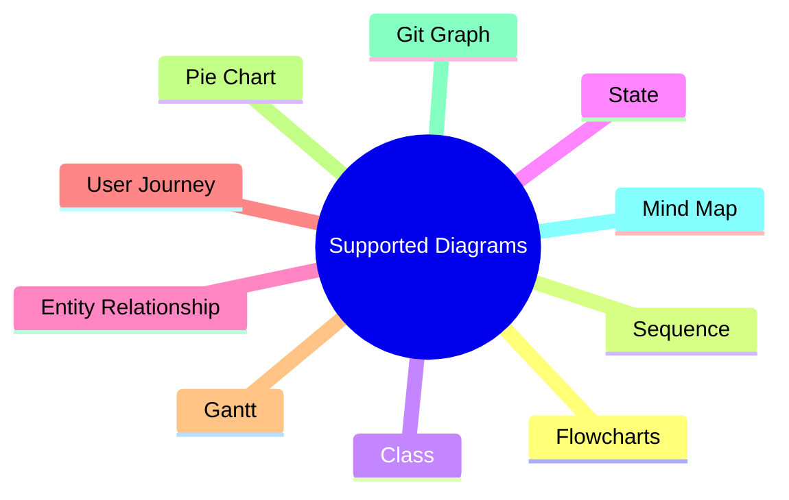

# ADO Markdown Mermaid

A powerful Azure DevOps extension that renders Mermaid diagrams directly in markdown files within Azure Repos. This extension enhances your documentation by providing interactive diagram visualization for sequence diagrams, flowcharts, mind maps, Gantt charts, and more.

## 🌟 Features

- **Mermaid Diagram Rendering**: Supports all Mermaid diagram types including:
  - Sequence diagrams
  - Flowcharts
  - Mind maps
  - Gantt charts
  - Class diagrams
  - And many more!
- **Markdown Parsing**: Full markdown support with tables, lists, code blocks, and formatting
- **Live Preview**: Real-time rendering in Azure DevOps
- **Easy Integration**: Works seamlessly with existing markdown files

## 📋 Prerequisites

- Node.js (version 14 or higher)
- npm or yarn package manager
- Azure DevOps account for testing

## 🚀 Getting Started

### Development Setup

1. **Clone the repository**
   ```bash
   git clone https://github.com/javiramos1/ado-markdown-mermaid.git
   cd ado-markdown-mermaid
   ```

2. **Install dependencies**
   ```bash
   npm install
   ```

3. **Development server**
   ```bash
   npm run serve
   ```
   This starts a webpack dev server for local testing at `http://localhost:8080`

### Building for Production

1. **Build the extension**
   ```bash
   npm run build
   ```
   This creates the production bundle and generates the `.vsix` extension package.

2. **The built extension will be available in the root directory as a `.vsix` file**

## 🧪 Testing

### Local Testing

The project includes a comprehensive test markdown file with various elements:

1. **Start the development server**
   ```bash
   npm run serve
   ```

2. **Open your browser** and navigate to `http://localhost:8080`

3. **Test various markdown features** including:
   - Text formatting (bold, italic, strikethrough)
   - Lists (ordered, unordered, task lists)
   - Tables with alignment
   - Code blocks
   - Mermaid diagrams
   - Blockquotes and nested elements

### Azure DevOps Testing

1. **Upload the extension** to Azure DevOps marketplace or install locally
2. **Navigate to any markdown file** in Azure Repos
3. **Verify that Mermaid diagrams render correctly**

## 📁 Project Structure

```
ado-markdown-mermaid/
├── src/
│   ├── index.js          # Main extension entry point
│   └── viewer.js         # Markdown and Mermaid renderer
├── dev/
│   ├── dev.js           # Development utilities
│   └── test.md          # Test markdown file
├── marketplace/
│   ├── overview.md      # Marketplace description
│   ├── logo.png         # Extension logo
│   └── changelog.md     # Version history
├── package.json         # Project dependencies
├── vss-extension.json   # Azure DevOps extension manifest
├── webpack.config.js    # Build configuration
└── index.html          # Main HTML template
```

## 🔧 Technical Details

### Dependencies

- **marked**: Modern markdown parser with extensibility
- **mermaid**: Diagram rendering library
- **azure-devops-extension-sdk**: Azure DevOps integration

### Supported Mermaid Diagrams



## 🤝 Contributing

1. **Fork the repository**
2. **Create a feature branch**: `git checkout -b feature/your-feature-name`
3. **Make your changes**
4. **Test thoroughly** using `npm run serve`
5. **Commit your changes**: `git commit -m 'Add some feature'`
6. **Push to the branch**: `git push origin feature/your-feature-name`
7. **Open a Pull Request**

## 📝 License

This project is licensed under the Apache License 2.0 - see the [LICENSE](LICENSE) file for details.

## 🐛 Issues and Support

If you encounter any issues or have questions:

1. **Check existing issues** on [GitHub Issues](https://github.com/javiramos1/ado-markdown-mermaid/issues)
2. **Create a new issue** with detailed information about the problem
3. **Include sample markdown** that reproduces the issue

## 🏗️ Roadmap

- [ ] Enhanced Mermaid theme support
- [ ] Custom CSS styling options
- [ ] Export diagram functionality
- [ ] Performance optimizations
- [ ] Additional markdown extensions

## 👤 Author

**Javier Ramos**
- GitHub: [@javiramos1](https://github.com/javiramos1)

## 🙏 Acknowledgments

- [Mermaid](https://mermaid.js.org/) for the amazing diagram library
- [Marked](https://marked.js.org/) for the robust markdown parser
- Azure DevOps team for the extension platform