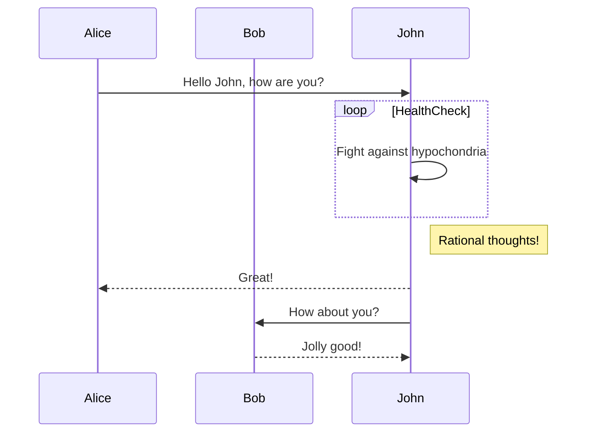
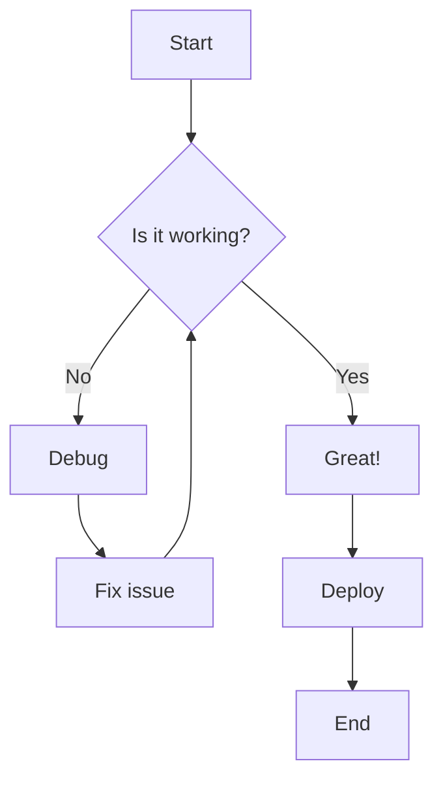
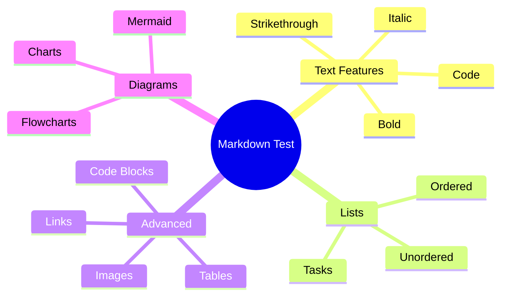
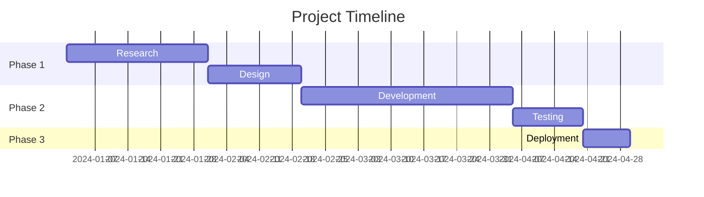
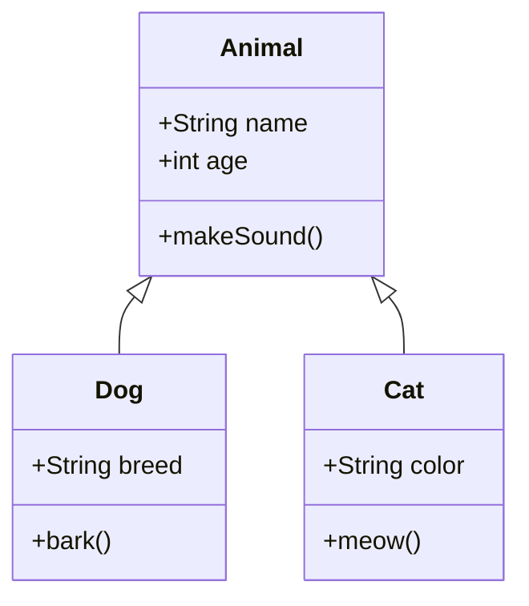

# Markdown & Mermaid Test

This document tests various markdown features with the **marked** parser.

## Text Formatting

This is a paragraph with **bold text**, *italic text*, ***bold and italic***, ~~strikethrough~~, and `inline code`.

> This is a blockquote.
> It can span multiple lines.
> > And even be nested!

---

## Lists

### Unordered List
- Item 1
- Item 2
  - Nested item 2.1
  - Nested item 2.2
    - Double nested item
- Item 3

### Ordered List
1. First item
2. Second item
   1. Nested numbered item
   2. Another nested item
3. Third item

### Task List
- [x] Completed task
- [ ] Incomplete task
- [x] Another completed task

---

## Tables

| Feature | Status | Priority |
|---------|--------|----------|
| Markdown parsing | ✅ Working | High |
| Mermaid diagrams | ✅ Working | High |
| Tables | 🧪 Testing | Medium |
| Code blocks | ✅ Working | High |

### Alignment Test

| Left Aligned | Center Aligned | Right Aligned |
|:-------------|:--------------:|--------------:|
| Left         | Center         | Right         |
| Test         | Test           | Test          |

---

## Code Blocks

### JavaScript
```javascript
function greet(name) {
  console.log(`Hello, ${name}!`);
  return true;
}
```

### Python
```python
def fibonacci(n):
    if n <= 1:
        return n
    return fibonacci(n-1) + fibonacci(n-2)
```

### Inline Code
Use the `marked.parse()` function to convert markdown to HTML.

---

## Links and Images

[Visit GitHub](https://github.com)

[Link with title](https://example.com "Example Website")

Auto-link: https://www.example.com

---

## Mermaid Diagrams

### Sequence Diagram


### Flowchart


### Mind Map


### Gantt Chart


### Class Diagram


---

## Nested Elements

1. **First Level**
   - Unordered nested
   - With *italic* text
   
2. **Second Level**
   > A blockquote inside a list
   > 
   > With multiple lines
   
3. **Third Level**
   ```javascript
   // Code block in a list
   const test = true;
   ```

---

## Horizontal Rules

Above

---

Below

***

Another one

___

Done!
