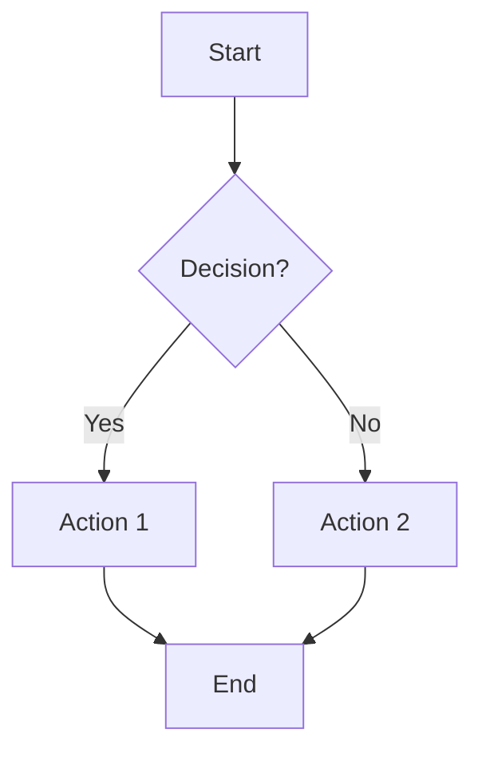
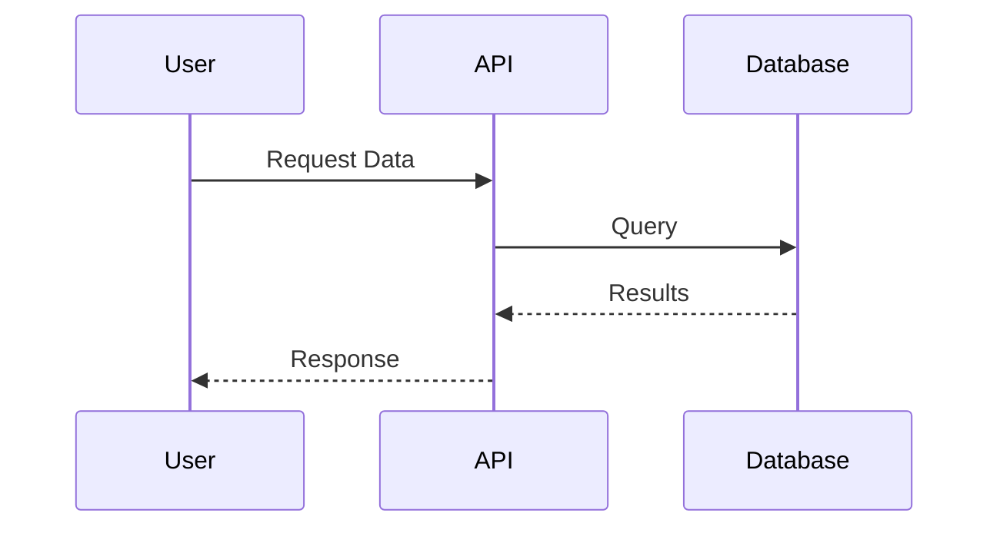
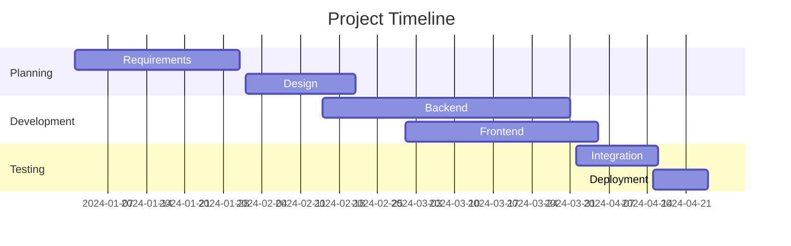

# ADO Markdown Mermaid

Transform your Azure DevOps documentation with beautiful, interactive diagrams! The **ADO Markdown Mermaid** extension brings powerful diagram rendering capabilities directly to your markdown files in Azure Repos.

## ✨ What does this extension do?

This extension automatically renders **Mermaid diagrams** embedded in your markdown files, making your documentation more visual and easier to understand. No more static images or external tools - create diagrams with simple text syntax!

## 🚀 Key Features

### 📊 Rich Diagram Support
Create stunning diagrams using simple text syntax:

- **Flowcharts** - Visualize processes and decision trees
- **Sequence Diagrams** - Document system interactions
- **Mind Maps** - Organize ideas and concepts
- **Gantt Charts** - Project timelines and scheduling
- **Class Diagrams** - Software architecture visualization
- **State Diagrams** - System state transitions
- **Entity Relationship Diagrams** - Database design
- **User Journey Maps** - UX workflows
- **Git Graphs** - Version control visualization
- **Pie Charts** - Data representation

### 🎯 Seamless Integration
- **Zero Configuration** - Works out of the box
- **Markdown Compatible** - Preserves all standard markdown features
- **Live Rendering** - Diagrams appear instantly when viewing files
- **Repository Wide** - Works across all your markdown files
- **Team Friendly** - Everyone sees the same beautiful diagrams

### 🔧 Enhanced Markdown
Beyond Mermaid diagrams, enjoy full markdown support with:
- Tables with alignment
- Task lists and checkboxes
- Code syntax highlighting
- Nested lists and quotes
- Links and references
- Text formatting

## 📖 How to Use

Simply add Mermaid diagrams to your markdown files using code blocks:

````markdown

````

The extension will automatically render these as interactive diagrams when you view the file in Azure Repos!

## 🎨 Example Diagrams

### Sequence Diagram
Perfect for documenting API interactions:


### Project Timeline
Visualize your project milestones:


### System Architecture
Document your software design:
```mermaid
classDiagram
    class User {
        +String name
        +String email
        +login()
        +logout()
    }
    class Order {
        +String id
        +Date created
        +calculate()
    }
    User ||--o{ Order : places
```

## 🏢 Perfect for Teams

- **Documentation** - Create living architectural diagrams
- **Project Management** - Visual project timelines and workflows  
- **API Design** - Sequence diagrams for system interactions
- **Database Design** - Entity relationship diagrams
- **Process Documentation** - Flowcharts for business processes
- **Onboarding** - Mind maps for knowledge organization

## 🎯 Why Choose ADO Markdown Mermaid?

### ✅ Benefits
- **No External Tools** - Everything works within Azure DevOps
- **Version Controlled** - Diagrams live with your code
- **Always Up-to-Date** - Text-based diagrams are easy to maintain
- **Collaborative** - Team members can easily edit and review
- **Professional** - Beautiful, consistent diagram styling
- **Fast** - Instant rendering with no performance impact

### 🔄 Before vs After

**Before:** Static images that get outdated, require external tools, and are hard to maintain

**After:** Living diagrams that update with your documentation, created with simple text, and always in sync

## 🚀 Get Started in Seconds

1. **Install** this extension from the Azure DevOps Marketplace
2. **Navigate** to any markdown file in your Azure Repos
3. **Add** Mermaid diagrams using the ` ```mermaid ` code block syntax
4. **View** your file to see beautiful rendered diagrams!

No configuration needed - it just works!

## 🌟 What Our Users Say

> "This extension transformed how we document our architecture. Our diagrams are always current and look professional!" 
> *- Development Team Lead*

> "Creating flowcharts for our processes has never been easier. The whole team can contribute now!"
> *- Project Manager*

## 📚 Resources

- [Mermaid Documentation](https://mermaid.js.org/) - Learn the diagram syntax
- [GitHub Repository](https://github.com/javiramos1/ado-markdown-mermaid) - Source code and examples
- [Issue Tracker](https://github.com/javiramos1/ado-markdown-mermaid/issues) - Report bugs or request features

## 🤝 Support

Having issues or questions? We're here to help!

- Check our [GitHub Issues](https://github.com/javiramos1/ado-markdown-mermaid/issues) for common problems
- Create a new issue for bugs or feature requests
- Include sample markdown that reproduces any issues

---

**Ready to make your documentation beautiful?** Install ADO Markdown Mermaid now and start creating stunning diagrams in minutes!

*This extension is open source and licensed under Apache 2.0. Contributions welcome!*